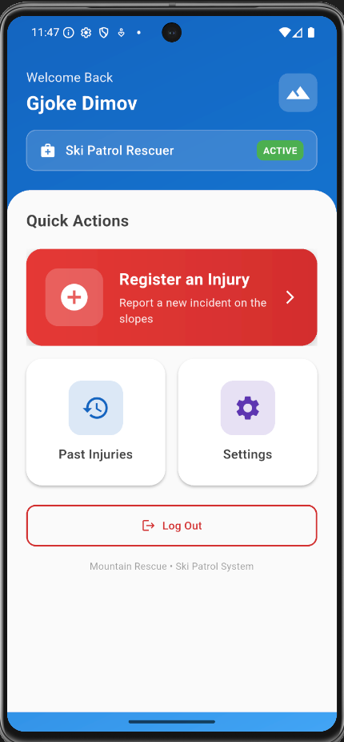
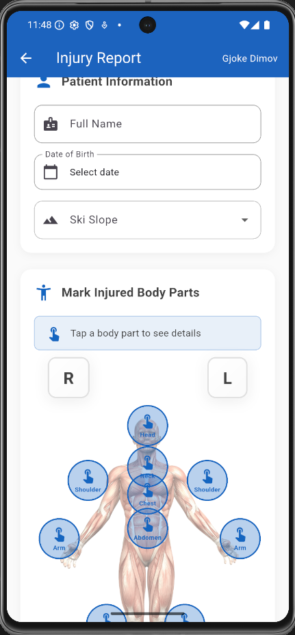
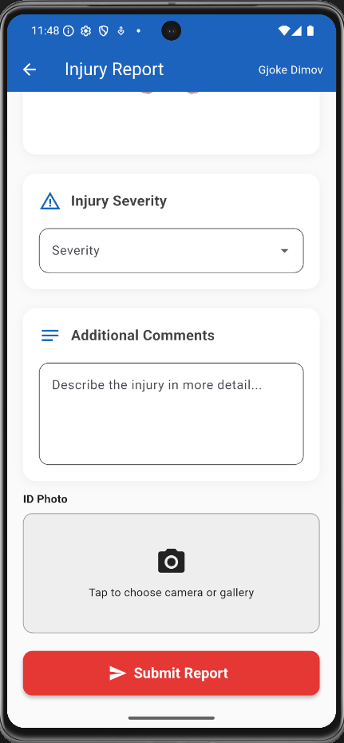
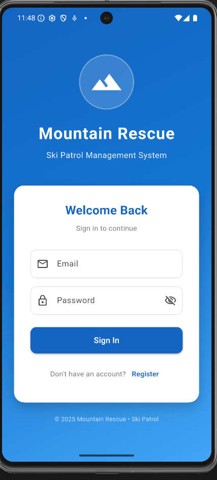
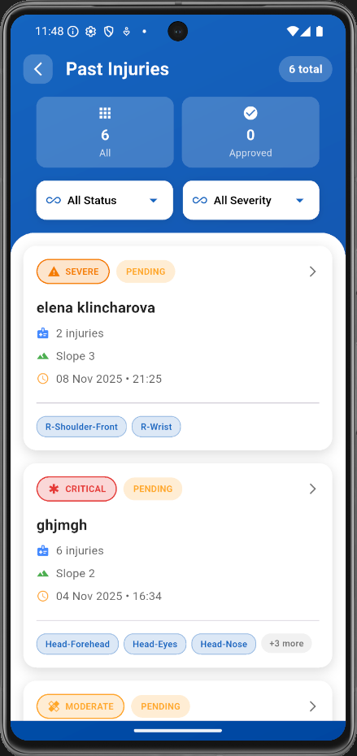
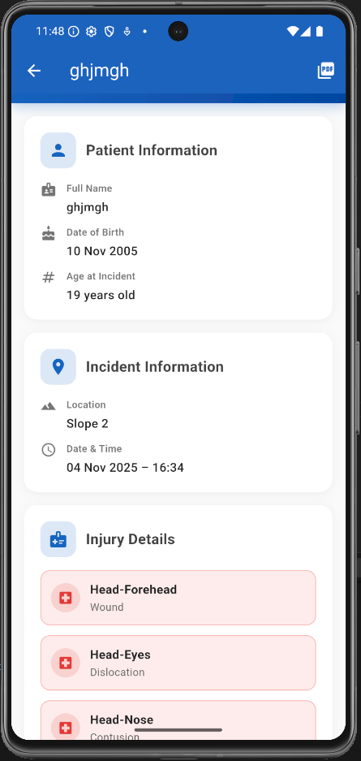
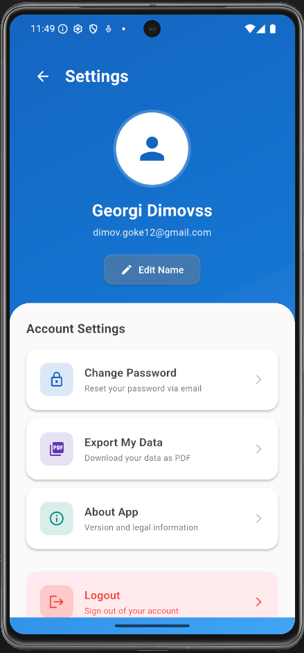
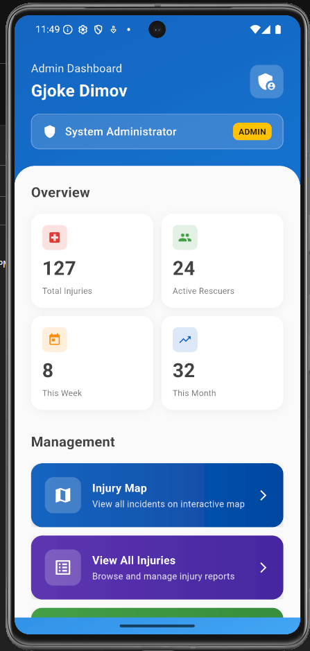
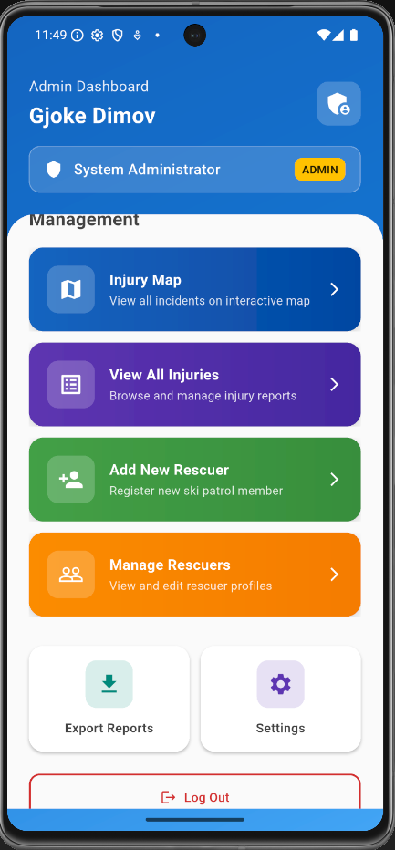

# mountain-rescue-app

# Mountain Rescue – Ski Patrol Management System

A **Flutter + Firebase** application for ski patrol and mountain rescue teams.
The app provides two roles: **Rescuer** and **Admin**, offering secure authentication, incident tracking, and report management.

---

## Overview

**Mountain Rescue** helps ski patrol members efficiently record, review, and manage injury reports.
Rescuers can log incidents directly from the field, while administrators monitor all activities, manage users, and generate official reports.

This system is built for clarity, scalability, and real-time collaboration using Flutter and Firebase technologies.

---

## Features

### Rescuer

- Secure login and registration
- Register new injury incidents
- View and manage past injury reports
- Generate PDF injury reports
- Edit profile and upload profile photo
- Password reset functionality

### Admin

- Administrative dashboard with system statistics
- View all injury reports from all rescuers
- Export PDF summaries for each report
- Manage rescuer profiles and system data
- Admin settings with profile photo, name edit, password reset, and support contact
- Generate complete system-level PDF reports

---

## Technology Stack

| Layer            | Technology                                    |
| ---------------- | --------------------------------------------- |
| Framework        | Flutter (Dart)                                |
| Backend          | Firebase (Authentication, Firestore, Storage) |
| State Management | Riverpod                                      |
| PDF Generation   | `pdf`, `printing`                             |
| Media Upload     | `image_picker`, `firebase_storage`            |
| Utilities        | `intl`, `url_launcher`, `package_info_plus`   |
| Additional       | Supabase Edge Functions                       |

Firebase Data Structure
Users Collection (users)

All application users are stored in Firestore with Firebase Authentication integration. Each user has the following fields:

| Field       | Type      | Description                      | Example                             |
| ----------- | --------- | -------------------------------- | ----------------------------------- |
| `email`     | string    | User's email address             | `janez@gmail.com`                   |
| `name`      | string    | Full name of the user            | `Janez Novak`                       |
| `role`      | string    | User role (`rescuer` or `admin`) | `rescuer`                           |
| `createdAt` | timestamp | Account creation date            | `October 31, 2025 at 7:26 PM UTC+1` |

Injuries Collection (injuries)

Each injury report is stored as a Firestore document with detailed metadata.

| Field              | Type        | Description                                           | Example                                                                                                            |
| ------------------ | ----------- | ----------------------------------------------------- | ------------------------------------------------------------------------------------------------------------------ |
| `description`      | string      | General injury description                            | `Very bad`                                                                                                         |
| `injuries`         | array/map   | List of injuries with body part and type              | `[{"bodyPart": "R-Shoulder-Front", "injuryType": "Dislocation"}, {"bodyPart": "R-Wrist", "injuryType": "Sprain"}]` |
| `patientName`      | string      | Name of the injured patient                           | `Matea Branko`                                                                                                     |
| `patientBirthDate` | timestamp   | Date of birth of the patient                          | `June 12, 2004`                                                                                                    |
| `photoUrl`         | string      | Public URL to the patient's photo in Firebase Storage | `https://hrghcaaqxkznzpwexuaq.supabase.co/storage/v1/object/public/injury-files/9iPxxJScKDZ6FrYENWaC/id_photo.jpg` |
| `rescuerId`        | string      | UID of the rescuer who logged the incident            | `jRRskmDGXKhtKptwmaaOPPxFVsY2`                                                                                     |
| `rescuerName`      | string      | Name of the rescuer                                   | `Janez Novak`                                                                                                      |
| `rescuerEmail`     | string      | Email of the rescuer                                  | `example.example12@gmail.com`                                                                                      |
| `severity`         | string      | Severity level (`mild`, `moderate`, `severe`)         | `severe`                                                                                                           |
| `signatureUrl`     | string/null | URL to rescuer signature (if any)                     | `null`                                                                                                             |
| `skiSlope`         | string      | Location of the incident                              | `Slope 3`                                                                                                          |
| `status`           | string      | Report status (`pending`, `approved`, `rejected`)     | `pending`                                                                                                          |
| `timestamp`        | timestamp   | Report creation timestamp                             | `November 8, 2025 at 9:25 PM UTC+1`                                                                                |

Firebase Authentication

Users sign up or log in via Firebase Auth.

Roles are assigned at creation: rescuer or admin.

Role-based access rules are enforced in Firestore Security Rules.

Supabase Storage

Injury and user photos are stored in Supabase Storage.

Edge Functions handle secure signed URLs for downloads or uploads.

Public URLs are stored in the Firestore documents (photoUrl, signatureUrl).

---

## Project Structure

```
lib/
├── data/
│   ├── models/
|   │   ├── injury_model.dart
│   │   └── user_model.dart
│   └── repositories/
|       ├── injury_repository.dart
│       └── auth_repository.dart
│
├── features/
│   ├── auth/
│   │   ├── login_screen.dart
│   │   └── register_screen.dart
│   │
│   ├── rescuer/
|   |   ├── injury_detail_screen.dart
│   │   ├── rescuer_home.dart
│   │   ├── past_injuries_screen.dart
│   │   └── settings_screen.dart
│   │
│   ├── admin/
│   │   ├── admin_home.dart
│   │   ├── admin_settings_screen.dart
│   │   └── admin_injuries_screen.dart
│
├── routes/
│   └── app_router.dart
│
├── state/
│   └── providers/
|       ├── user_provider.dart
|       ├── injury_provider.dart
|       ├── role_provider.dart
│       └── auth_provider.dart
│
├── firebase_options.dart
└── main.dart
```

---

## Setup Instructions

### Prerequisites

- Flutter SDK installed (version 3.22 or later)
- Active Firebase project with Authentication, Firestore, and Storage enabled
- FlutterFire CLI configured (`flutterfire configure`)

### Installation

```bash
# Clone the repository
git clone https://github.com/yourusername/mountain-rescue.git
cd mountain-rescue

# Install dependencies
flutter pub get
```

### Firebase Setup

Run the FlutterFire CLI and link your Firebase project:

```bash
flutterfire configure
```

Ensure that `firebase_options.dart` is generated inside `/lib/`.

### Running the App

```bash
flutter run
```

---

## Core Dependencies

| Package             | Purpose                          |
| ------------------- | -------------------------------- |
| `firebase_core`     | Firebase initialization          |
| `firebase_auth`     | Authentication                   |
| `cloud_firestore`   | Realtime database                |
| `firebase_storage`  | File storage (photos, documents) |
| `flutter_riverpod`  | State management                 |
| `image_picker`      | Selecting images for profiles    |
| `pdf`, `printing`   | PDF generation and sharing       |
| `intl`              | Date and time formatting         |
| `url_launcher`      | Opening external links or emails |
| `package_info_plus` | App metadata (version, build)    |

---

## PDF Reports

The system uses the **Dart `pdf`** package to generate detailed and print-ready PDF reports containing:

- Date and time of the incident
- Injury type, severity, and description
- Location of occurrence
- Assigned rescuer details
- Automatically formatted timestamps and metadata

---

## Security

- Firebase Authentication ensures secure user access
- Firestore security rules separate rescuer and admin access levels
- Passwords are encrypted and handled exclusively by Firebase
- Profile and injury photos are stored in Firebase Storage with restricted access

---

## Future Enhancements

- GPS-based injury location tracking
- Advanced filters for injury reports (severity, rescuer, date)
- Digital signatures on PDF reports
- Offline mode and local caching
- Push notifications for new incidents

---

## Use Case Diagram


---

## Images of application











## Vodič za ponovitev ključne funkcionalnosti

Ta vodič ponuja hiter in strukturiran pregled glavnih funkcionalnosti aplikacije **Mountain Rescue**, namenjen ponovitvi ali demonstraciji sistema.

### 1. Prijava in vloge uporabnikov

- Uporabniki se prijavijo ali registrirajo prek **Firebase Authentication**
- Ob registraciji se dodeli vloga:
  - **Rescuer** – reševalec na terenu
  - **Admin** – skrbnik sistema
- Dostop do funkcionalnosti je omejen glede na vlogo (Firestore Security Rules)

### 2. Registracija poškodbe (Rescuer)

- Rescuer lahko:
  - vnese podatke o poškodovancu
  - določi stopnjo poškodbe (`mild`, `moderate`, `severe`)
  - izbere smučišče oziroma lokacijo
  - doda fotografije in opis poškodbe
- Podatki se shranijo v **Firestore (injuries collection)**

### 3. Pregled in upravljanje poročil

- Rescuer:
  - pregleda svoja pretekla poročila
  - ustvari **PDF poročilo** za posamezno poškodbo
- Admin:
  - vidi vsa poročila vseh reševalcev
  - pregleda podrobnosti posameznih poškodb
  - izvaža sistemska PDF poročila

### 4. Upravljanje uporabnikov (Admin)

- Admin lahko:
  - pregleda profile reševalcev
  - upravlja sistemske nastavitve
  - ureja svoj profil (ime, fotografija, geslo)

### 5. PDF poročila

- Samodejno generirana poročila vključujejo:
  - podatke o poškodbi
  - lokacijo in čas dogodka
  - stopnjo poškodbe in opis
  - podatke o odgovornem reševalcu
- Poročila so pripravljena za tisk ali deljenje

### 6. Varnost in shranjevanje podatkov

- Avtentikacija in avtorizacija: **Firebase Authentication & Firestore Rules**
- Fotografije poškodb in profila: **Supabase Storage**
- Dostop do datotek je nadzorovan s podpisanimi URL-ji

# Authors

**Andrej Delimanchev**
Faculty of Electrical Engineering and Computer Science (FERI), Maribor
Email: [delimanchev@gmail.com](mailto:delimanchev@gmail.com)
GitHub: [github.com/delimanchev](https://github.com/delimanchev)

**Georgi Dimov**
Faculty of Electrical Engineering and Computer Science (FERI), Maribor
Email: [dimov.goke12@gmail.com](mailto:dimov.goke12@gmail.com)
GitHub: [github.com/Gjoce](https://github.com/Gjoce)
